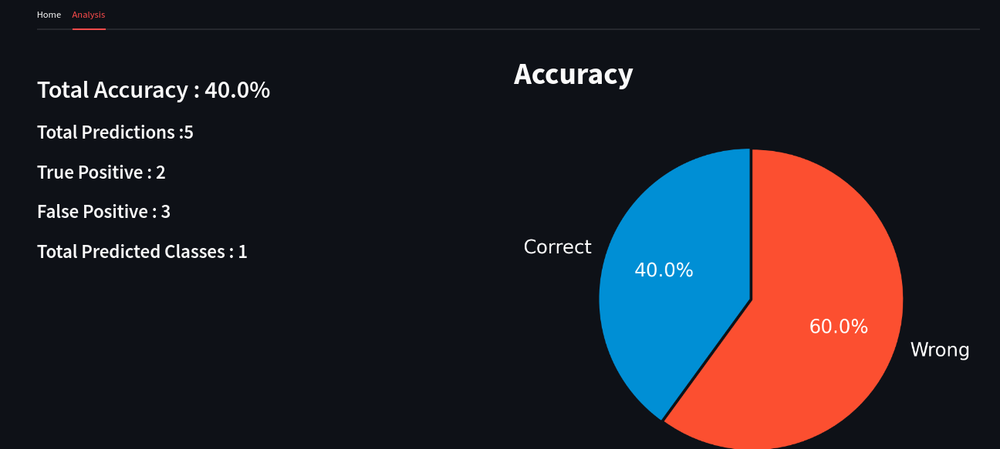
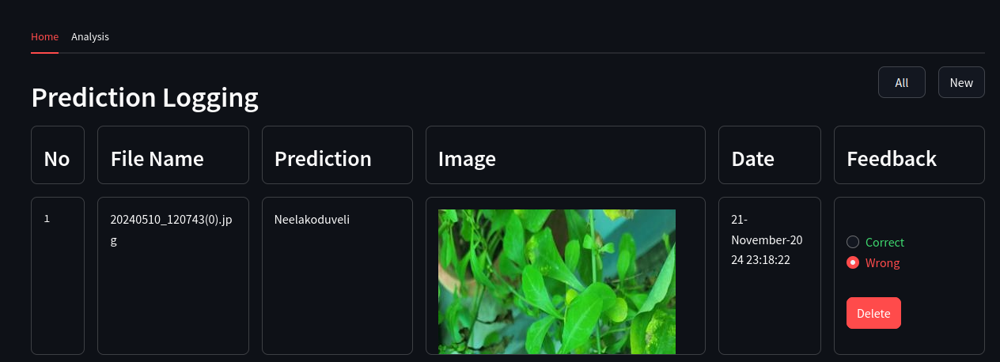

# Model Feedback and RLHF Analysis Dashboard

- This Streamlit application provides an intuitive interface for viewing and analyzing model predictions. It allows users to provide feedback on predictions, enabling a feedback loop to improve model performance through Reinforcement Learning from Human Feedback (RLHF).
-  By collecting feedback data, the app helps identify areas where the model can be retrained and refined, enhancing its adaptability to real-world scenarios.
-  The application aims to optimize model predictions and supports continuous learning to improve accuracy and reliability over time.
#### Model Performance

#### Model Prediction Analysis

